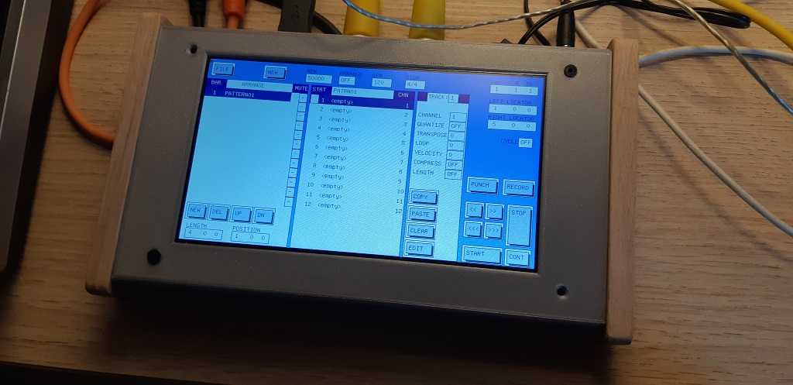
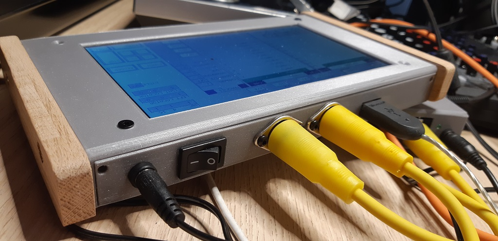

# CreatorMaster2k

This is a just for fun project where I want to recreate the feel of the Atari platform Creator/Notator sequencer running on a Teensy 4 with peripherals.

Warning: this is very much in work and there will probably be no "released" versions. Use the code for inspiration mainly.

Parts used:
- Teensy 4.1
- 7" RA8875-based display 
- A few connectors for midi and power
- Usb mouse

It is fairly easy to build your own version as you only need the Teensy 4.1 and the 7" display plus a couple of connectors.
I do have a custom pcb to break out pins from the Teensy but that is not required, you can do it on a breadboard.

Link to the display:
https://www.buydisplay.com/7-inch-lcd-module-capacitive-touch-screen-panel-i2c-spi-serial

Fair warning: these larger displays are very power hungry.

